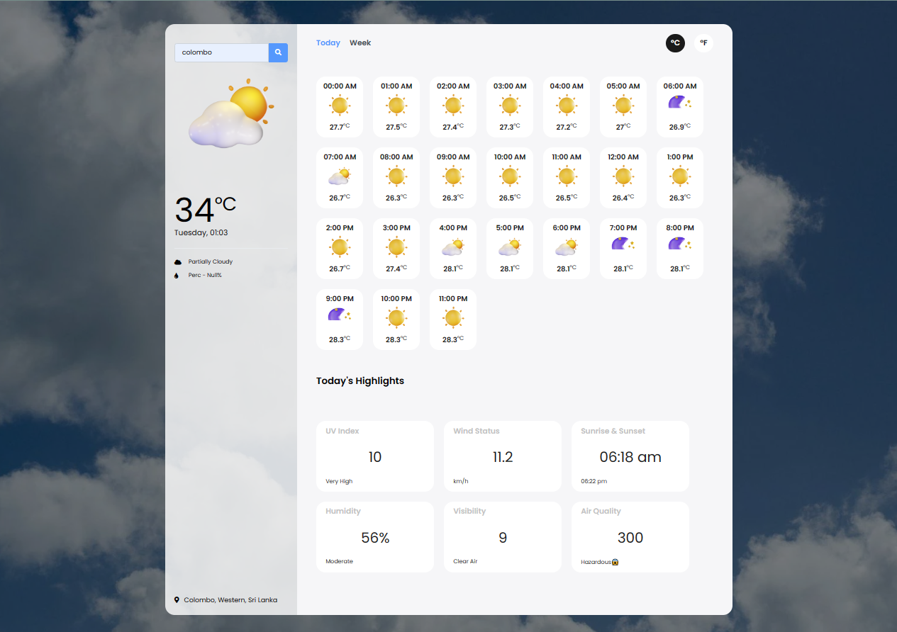
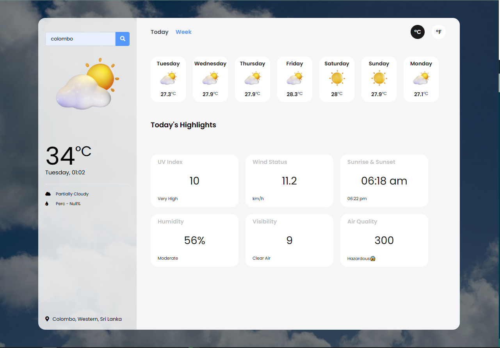

# Weather App

## Table of Contents

- [Introduction](#introduction)
- [Screenshot](#screenshot)
- [Demo](#demo)
- [Features](#features)
- [Getting Started](#getting-started)
- [File Structure](#file-structure)
- [Contributing](#contributing)
- [License](#license)

## Introduction

This repository contains the source code for a simple Weather App. The application provides weather information for a specific location, including current conditions, temperature, date and time, and various highlights such as UV index, wind status, sunrise and sunset times, humidity, visibility, and air quality.

## Screenshot

<div align="center">
   
   
</div>

## Demo

Click [here](https://gmpsankalpa.github.io/Weather-Forecast-Web-App/) to view Demo.

## Features

- Search Functionality: The app allows users to search for weather information for a specific location.

- Current Weather Display: It displays the current weather conditions, temperature, date and time.

- Weather Icons: Weather icons are dynamically updated based on the current weather conditions.

- Temperature Unit Switch: Users can switch between Celsius (°C) and Fahrenheit (°F) temperature units.

- Hourly and Weekly Options: The app provides options to view either today's hourly forecast or the weekly forecast.

- Highlights Section: Displays key weather highlights, including UV index, wind status, sunrise and sunset times, humidity, visibility, and air quality.

## Getting Started

To run the Weather App locally, follow these steps:

1. Clone the repository to your local machine:

   ```bash
   git clone https://github.com/gmpsankalpa/Weather-Forecast-Web-App.git

2. Navigate to the project directory:
 
   ```bash
   cd Weather-Forecast-Web-App

3. Open the `index.html` file in your preferred web browser.

## File Structure

- `index.html`: The main HTML file that defines the structure of the Weather App.

- css/`style.css`: The stylesheet file that defines the visual style of the application.

- icons/: Directory containing weather icons.

- js/`script.js`: The JavaScript file responsible for handling the app's functionality.

## Contributing
If you'd like to contribute to the Weather App, please follow these steps:

1. Fork the repository on GitHub.
2. Create a new branch for your feature: `git checkout -b feature-name`.
3. Make your changes and commit them: `git commit -m 'Add new feature'`.
4. Push your changes to your fork: `git push origin feature-name`.
5. Open a pull request on the main repository.

## License

This Weather App is licensed under the [MIT](LICENSE) License.

---
<div align="center">

   
   
   
   

</div>